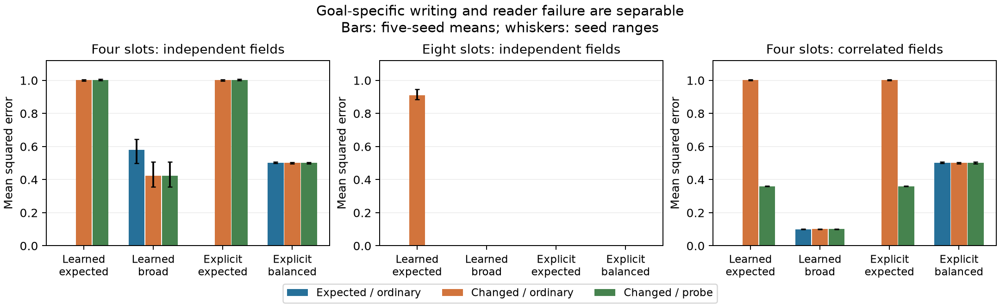

# Memory under goal shift: separate selection from reader failure

**Completed bounded study, 14 September 2026.** In this linear test-time memory,
training for expected questions can make other fields unavailable to useful
precision when capacity is tight. At sufficient capacity, similar answering
failure can instead be repaired by replacing the reader while preserving the
stored state. Explicit compression shows the same dependence on which
information is preserved. These are synthetic mechanism results, not evidence
that neural memory generally loses more than explicit records.

## Experiment and timing

Each history contains eight keyed records with eight real-valued fields.
Expected questions ask for the first four fields; changed questions ask for
the other four. All fields are visible during writing, but the actual query
key, field, and expected/changed family are withheld. We evaluate both families
on the same frozen state. Training knows the expected question distribution;
a broad control reconstructs every input field without seeing future queries.
The investigator knows the possible evaluation families. Changed fields are
independent of expected fields, or correlated at rho=.8 in a second condition.

A slow learned matrix E projects eight fields into r={2,4,8} scalar slots.
The episodic fast weights W start at zero. Each record causes an SGD update on
half squared prediction error, targeting xE. Fixed orthogonal keys make the
final state W=XE; ordinary reading uses WE^T. W persists across reads and resets
between histories. E persists across episodes. No history, teacher, optimizer
state, or intermediate activations are available to the reader. This tests
selection at the write interface, not temporal forgetting of previously stored
records. The elementary update is grounded in [TTT layers §2](https://arxiv.org/html/2407.04620v4),
with substantial simplifications documented in the [source ledger](sources/README.md).

Twelve development fits established acquisition. The unchanged recipe then
trained 60 fresh fits: five seeds × three capacities × two objectives × two
correlations. Each seed/condition uses 2,048 held-out histories. A privileged
linear reader is fitted afterward on 1,024 separate histories with all field
labels, keeping E and W unchanged. It diagnoses recoverability; it is not
ordinary performance. The [frozen protocol](notes/PROTOCOL.md) and
[development record](notes/DEVELOPMENT.md) specify the separation and budgets.

## Fresh evaluation results

Mean squared error (MSE), averaged across five seed/data blocks; lower is
better. Each field has population variance one, so zero prediction has MSE one.
“≈0” below means less than 1e-10. The full-record reference recovers exactly.

| Independent fields | Slots per record | Expected, ordinary | Changed, ordinary | Changed, privileged reader |
| --- | ---: | ---: | ---: | ---: |
| Learned, expected objective | 4 | ≈0 | 1.001 | 1.002 |
| Learned, broad objective | 4 | 0.581 | 0.422 | 0.423 |
| Explicit, expected fields | 4 | 0 | 1.001 | 1.002 |
| Explicit, balanced fields | 4 | 0.503 | 0.501 | 0.501 |
| Learned, expected objective | 8 | ≈0 | 0.909 | ≈0 |
| Learned, broad objective | 8 | ≈0 | ≈0 | ≈0 |

All sufficient-capacity expected-objective fits acquired expected queries:
MSE below 7e-15. Two-slot fits plateau near .5 expected error, consistent with
insufficient capacity for four independent coordinates; those runs are retained.
Four-slot changed-first explicit records, given advance family information,
recover changed fields exactly. This is a hindsight control, not a goal-blind
competitor. [All conditions and paired differences](analysis/TABLES.md) include
random projections, full records, and all capacities; [summary JSON](analysis/summary.json)
retains seed ranges and descriptive seed-bootstrap intervals.

Three distinctions explain the results:

1. **Selection during writing.** With four slots, expected-only learning puts
   almost all useful capacity into expected fields. Its changed-field probe
   error rises from .477 for the initial projection to 1.002 for the trained
   projection on newly written histories. This does not show changed fields
   were first acquired and later erased within one episode. Expected-first
   explicit records behave the same way; broad learned and balanced explicit
   representations make a different capacity tradeoff.
2. **Reader failure despite retained information.** With eight slots, expected-only
   ordinary changed error is .909, but a separately fitted decoder reduces it
   to 4.65e-12 on the same float32 states. Every seed recovers changed fields
   below 2.2e-11. The tied reader E^T is poorly calibrated on unsupervised
   directions; its failure cannot establish information loss.
3. **Predictability is not complete retention.** With rho=.8 and four slots,
   expected-only changed error falls from 1.003 to .361 under a new reader.
   Retaining expected fields already predicts part of each changed field;
   the ideal unexplained variance is 1−rho²=.36. This recovery does not imply
   the independent innovation in each changed field was preserved.

For a Gaussian input with covariance Sigma and ideal observation xE, the
conditional covariance is Sigma−Sigma E(E^T Sigma E)^+E^T Sigma. Under independent
fields, its trace is 8−r; with four slots and essentially perfect expected
recovery, changed-field average conditional MSE is essentially one. This is
an analytic diagnostic of this linear Gaussian mechanism, including its optimal
reader, rather than an inference from probe failure alone. Exact bounds for
continuous arithmetic do not automatically apply to float32 rounding; we retain
actual float32 states' hashes, singular values and empirical recovery evidence.

## Stronger explicit control on fresh histories

Broad learning's correlated four-slot error (.100 expected, .101 changed)
looked better than balanced field subsets (.503, .502). The subset baseline
stores redundant correlated pairs. A [bounded supplement](notes/SUPPLEMENT_PROTOCOL.md),
frozen after observing that comparison, tested explicit normalized pairwise
sums on fresh histories, with no new model fitting. They require the same four
float32 slots and reconstruct both members using their average.

On this fresh material, explicit derived records achieve **.09992 / .09992**
expected/changed MSE; frozen broad learned memories achieve **.10006 / .10127**.
The explicit result matches the analytic prediction (1−rho)/2=.1.
Thus the earlier advantage over field subsets is explained by representing
correlations, without requiring learned storage. This is an explanatory control,
not a formal statistical equivalence test. [Supplement results](analysis/supplement/summary.json)
retain both correlations and [individual outcomes](analysis/supplement/results.json).

## Costs, verification, and scope

E and W each contain 8r float32 scalars: 128 shared parameter bytes plus 128
per-history state bytes at r=4. Explicit four-slot payload is also 128 bytes;
full records use 256. These match episodic payload, not total system bytes or
compute. The privileged float64 readout adds 64r bytes and 8,192 labeled fit
records per representation. Key/field schemas and explicit transforms are
shared configuration. No teacher or model endpoint was used.

The 72 total outer fits processed 22,118,400 training records and used about
12.27 seconds of measured training-loop CPU time on the local Apple M1 Ultra,
one torch thread. This excludes installation, data verification, source reading,
most diagnostics and documentation. [Cost records](analysis/costs.json) and the
protocol disclose writing, reading, optimizer and probe costs. No heavyweight
shared-machine run was needed.

[Verification](analysis/verification.json) reloads all 324 initial/final/control
representations and 30 supplemental representations, checks stored-state hashes,
ordinary and probe metrics, probe normal equations, protocol/source hashes,
and independent NumPy projection/covariance calculations. All matrices and
readouts are retained in JSON; no excluded model file is needed. The evaluation
was frozen at `1081c78`; the supplement at `39d6095`.

The bounded contribution is an interpretable separation of capacity allocation,
reader calibration, and prediction through correlations. Fixed keys make lookup
trivial; the memory has a row per known key. Linear tied projections and
Gaussian fields admit unusually strong diagnostics. Five seeds do not establish
broad population behavior, and these experiments test neither language-model
reasoning, long-history interference, nor arbitrary unseen goal families.
PERK, TTCD and Self-Guided TTT were read for their differing write/query timing;
none of their full systems or benchmark results was reproduced. Extending this
separation to a nonlinear memory with learned addressing remains open.
