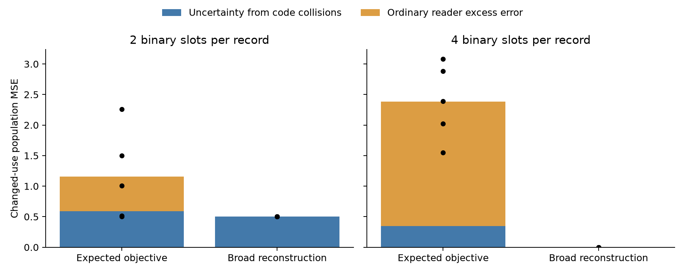

# Nonlinear memory: reader error and unavailable information coexist

**Completed follow-up, 14 September 2026.** The selection-versus-reader
distinction survives a nonlinear finite-state experiment. Expected-task
training learns parity questions perfectly at four binary slots, yet changed
raw-field error combines a large repairable reader component with uncertainty
from identical stored codes. Broad reconstruction retains all fields, as does
a cheaper explicit full-record reference. Nominal capacity sufficient for all
inputs does not guarantee that the learned writer uses it.

This extends the [accepted linear study](../FINDINGS.md) without changing it.
It is a synthetic mechanism result, not a language-model result or an isolated
causal test of nonlinearity. Distribution, precision, architecture and tasks
change together. [Methods reading](sources/README.md) distinguishes this local
implementation from TTT-MLP and published straight-through estimators.

## Mechanism, timing and acquisition

Each history has eight fixed-key records, each containing four independent
uniform signs (a,b,c,d). Expected questions request ab or cd; changed questions
request a raw sign. A learned tanh MLP encodes each record into two or four
exact signs. A unit gradient step on squared prediction error writes those
signs into an eight-row fast-weight matrix. The matrix resets for each history
and stays fixed across questions. The ordinary MLP reader estimates four raw
fields and multiplies them for parity answers. Encoder and decoder persist
across histories; no history, logits or optimizer state reaches reads. Fixed
orthogonal keys and interference-free writes remain from the first study.

Expected training minimizes parity MSE; broad training reconstructs input
fields. Both families are known to the investigator; expected training knows
parity targets, while broad training knows the raw-input distribution. Neither
writer receives actual future query keys, fields or families. Broad
reconstruction directly covers the changed raw-field targets, so this is not
evidence about arbitrary unknown future functions. No teacher is used.

Eight development fits established four-slot acquisition. Two-slot expected
training failed despite explicit parity storage being sufficient. Six bounded
diagnostic optimizer phases showed that the same reader works with supplied
parity codes, and the learned encoder can acquire those codes under direct
intermediate supervision. This supports an optimization limitation of joint
training, not an architectural impossibility. These privileged diagnoses are
preserved separately and do not count as ordinary performance.

The [protocol](notes/PROTOCOL.md) and executable were frozen at **`c273ec9`**.
Twenty fresh fits use five seeds × two capacities × two objectives, with 4,096
fresh histories per seed and 512 separate histories to fit alternative readers.
All 16 possible record types occur in the training distribution; fresh histories
are new independent draws, not unseen record types. No evaluation fit was
excluded, retuned or selected for success.

## Fresh comparison

MSE, averaged across five seed blocks; lower is better, and zero prediction
has population MSE one. The fitted reader is a state-indexed table of six
conditional target means, trained on 4,096 labeled records after freezing the
writer. It has all goal labels and extra compute; it is diagnostic performance.
The exhaustive reader computes optimal conditional means over the 16 equally
likely inputs, independently of the sampled test histories.

| Representation | Slots | Expected ordinary | Changed ordinary | Changed fitted reader | Changed population optimum |
| --- | ---: | ---: | ---: | ---: | ---: |
| Learned, expected objective | 2 | .496 | 1.158 | .588 | .588 |
| Learned, broad reconstruction | 2 | .601 | .501 | .500 | .500 |
| Learned, expected objective | 4 | <1e-12 | 2.384 | .351 | .350 |
| Learned, broad reconstruction | 4 | <3e-7 | <1e-7 | 0 | 0 |
| Explicit full raw records | 4 | 0 | 0 | 0 | 0 |

[Complete tables](analysis/TABLES.md) include per-seed risks and five explicit
controls. Every four-slot expected fit acquires both parities; each has positive
changed uncertainty (.25–.50) and reader excess error (1.298–2.582). Broad fits
use all 16 codes, while expected fits use only 9–12. Two-slot expected fits all
fail acquisition on fresh evaluation too (.479–.500 population parity MSE).
Their objective comparison cannot establish a tradeoff between two equally
successful expected-task learners.

## What is available, and what the reader does

For a frozen code Z and target Y, squared-error risk separates exactly:

**ordinary error = E[Var(Y | Z)] + E[(ordinary answer − E[Y | Z])²].**

The four-slot expected objective has mean population changed error **2.384825**:
**.350000** is conditional uncertainty and **2.034825** is reader excess.
The fitted diagnostic's .350615 fresh-history error approaches the exhaustive
optimum. It recovers substantial information from unchanged states, but cannot
recover distinctions the encoder maps to exactly the same signs.

This stronger unavailability claim rests on complete, exact code partitions,
not failure of a probe or numerical rank thresholds. Every other record is
independent of the queried record, and writing is recordwise, so other rows
cannot resolve the ambiguity. The claim applies to this uniform finite
distribution and access boundary, not arbitrary data. Nothing here establishes
that missing distinctions were acquired and later erased within an episode;
selection happens at the write interface.

There is a specifically nonlinear reader constraint. The parity of conditional
raw-field means need not equal the conditional mean of the parity. For example,
if (a,b) can be (1,1) or (−1,−1), both field means are zero while ab is certainly
one. Expected training can output an arbitrary orientation and scale with the
right product, explaining raw-field errors above one. It is not an untrained
output head: all four outputs participate in parity training.

The alternative table answers each goal separately and thus has a richer
answering rule. A [post-evaluation algebraic check](analysis/moments.json) finds
that multiplying optimal raw estimates would introduce mean parity MSE .35,
whereas directly estimating parity retains zero error. The reader repair is
therefore not simply recalibration inside the original product-of-estimates
constraint. This qualification matters when extending the linear explanation.

## Explicit references and costs

Two explicit parity slots acquire expected tasks exactly. A competent analytic
reader returns stored parities for expected questions and zero for raw signs,
giving expected/changed MSE **0/1**. The logged canonical point reconstruction
instead gives **0/≈2**; its reader weakness must not be credited to learned
storage. Two explicit raw signs give **1/.5**, and the hybrid (ab,c) has optimal
risks **.5/.75**. Those transforms are supplied by the investigator. Full raw
records at four slots recover both families exactly without learning. An
invertible nonlinear explicit code also recovers exactly with an inverse reader;
its deliberately limited canonical reader is only a positive diagnostic audit.

Episodic payload is matched: two/four float32 sign slots per record cost
64/128 bytes per history, carrying 16/32 semantic bits. Neither branch is
bit-packed. Neural shared parameters add 1,816/2,336 bytes; explicit formulas
need no trained weights. Alternative float64 tables add 192/768 bytes, plus
32/128 bytes of fitting counts. Query schemas and program overhead are shared
configuration; total memory exceeds episode payload. The
[protocol](notes/PROTOCOL.md) specifies operation counts and
[cost record](analysis/costs.json) gives training and diagnostic budgets.

The 28 main fits and six diagnostic phases processed **7,264,000 records** in
**22.88 seconds** of measured local single-thread CPU training loops. This
excludes installation, source access, reader fitting, verification and analysis.
No shared-machine training, teacher or external model calls were needed.

## Verification, limits and conclusion

[Verification](analysis/verification.json) restores all 67 learned, diagnostic
and explicit representations; regenerates data; matches state hashes, tables
and metrics; and independently recomputes conditional risks and their exact
decomposition in NumPy. Maximum saved-versus-recomputed metric difference is
zero. All weights, codes, curves, failed attempts and readers are versioned.

The result broadens the original explanation: reader failure and unavailable
information can coexist in a learned nonlinear code even when nominal capacity
permits lossless storage. Nonlinear goals also require attention to what the
reader estimates. Broad raw reconstruction and competent explicit storage
remove the apparent storage-medium advantage. Five seeds, finite support,
hard quantization and fixed addressing leave natural-language memory, learned
addressing, noisy writes and genuinely novel goal structures untested.
