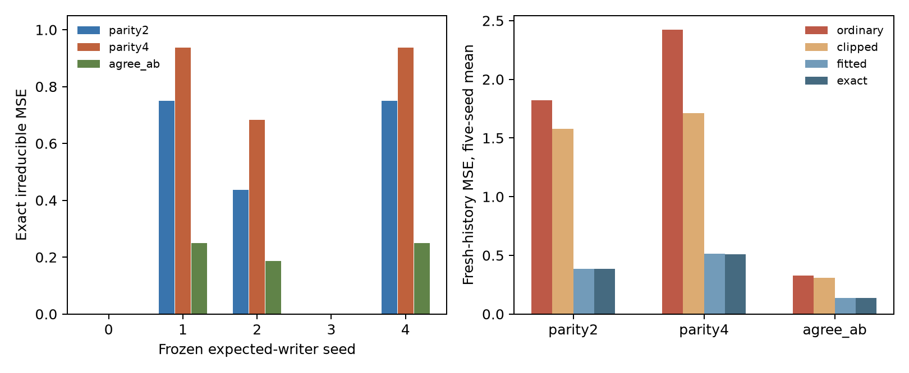

# Later combinations expose both selective retention and reader limits

**Third phase completed, 15 September 2026.** Learned memory can support
cross-event questions absent from writer training when it retains the relevant
components and the reader has the required operations. Narrow local-task
training makes that retention unreliable across seeds. A better reader repairs
large errors, but cannot resolve exact code collisions relevant to the query.
Broad reconstruction and competent explicit full records answer every tested
composition. There is no learned-storage advantage in this setting.

This extends the [linear](../FINDINGS.md) and [nonlinear](../followup/FINDINGS.md)
publications without changing their evidence. It tests new **compositions of
familiar records**, not unseen atomic types, learned reasoning, or language.
[Methods and provenance](sources/README.md) pin the public-method reading and
accepted donor revision; no novelty or full-method reproduction claim is made.

## What changed, and what each component knows

A history now contains 32 ordered, fixed-key events, each four independent
uniform signs (a,b,c,d): 16^32 possible histories. We reuse all calibrated
four-slot expected and broad writers from the accepted nonlinear study, rather
than train another mechanism. Each frozen encoder maps a record to four exact
signs. A unit gradient step on half squared row error writes the code into a
zero-initialized 32×4 float32 fast-weight matrix. The matrix resets per history
and remains unchanged during reads. Fixed positional keys are supplied. Only
this matrix and shared frozen reader parameters reach the reader; original
records remain exclusively with the evaluator and calibration procedure.

Expected writer training used single-record ab and cd targets. Broad training
reconstructed a,b,c,d. Neither received a cross-record target. Both learned
components saw all 16 atomic types in their original training. After writing,
we independently draw four distinct event keys and ask five questions:

- Expected use: ab and cd at the first key.
- Changed use: parity of a across two events; parity of a across four events;
  whether the first two events agree in **both a and b**.

Histories and query draws are fresh; the changed task families were wholly
absent from writer training. Finite key tuples are not required to be disjoint
between development and evaluation. The investigator knows all families.
Every reader receives supplied query algebra, so operation competence is
explicitly provided. Actual keys arrive only after writing. There is no teacher,
query-known writing, or raw evaluation-history access by an alternative reader.
The enlargement is compositional support and cross-event relations; events
remain independent, and order-sensitive reasoning is not tested.

## Calibration and fresh evaluation

Two development donor seeds passed acquisition and full-evidence competence
checks. The protocol and runner were frozen at **`06570bd`**. Evaluation uses
all five remaining accepted donor seeds, each on 8,192 fresh histories, paired
across conditions: **40,960 unique histories**. These are existing writers with
known prior atomic outcomes, not five newly trained independent replications.
All ten evaluation donors acquire expected questions with 100% accuracy.
No acquisition failure, tuning, exclusion or new gradient training was needed.
The prior two-slot failures remain in the previous study.

The ordinary reader composes decoded raw estimates. Clipping its complete
answers to [−1,1] is an additional unsupervised repair. The fitted alternative
estimates six conditional moments (a,b,c,d,ab,cd) per code from 4,096 separately
generated calibration records per seed, then applies the supplied query algebra.
It has extra raw labels and computation, but **no composed training labels**.
The exact diagnostic computes these moments from the complete 16-record support.
It diagnoses availability and is not ordinary deployment performance.

Fresh-history MSE, five-seed mean; lower is better. Parity's zero-prediction
baseline is 1; agreement's constant-mean baseline is .75.

| Memory and reader | Two-event parity | Four-event parity | Two-field agreement |
|---|---:|---:|---:|
| Expected writer, ordinary | 1.820447 | 2.422528 | .329352 |
| Expected writer, clipped ordinary | 1.577817 | 1.713512 | .309349 |
| Expected writer, fitted moments | .387176 | .511742 | .136104 |
| Expected writer, exact moments | .386938 | .511230 | .136279 |
| Broad writer, ordinary | <6e−7 | <6e−7 | <6e−7 |
| Explicit full raw, direct algebra | 0 | 0 | 0 |
| Explicit two-parity state, competent exact reader | 1 | 1 | .502734 |

Complete-answer accuracy for the expected writer rises from **57.84% to 80.71%**
on two-event parity and **52.00% to 74.34%** on four-event parity with the fitted
reader. Agreement rises from **92.55% to 93.23%**; its majority baseline is 75%.
Broad and full raw states have 100% accuracy for every task. MSE and accuracy
can disagree because calibration and thresholding differ. A fitted reader can
slightly beat the population-optimal reader on a finite sample; this does not
violate the population bound. [Complete tables](analysis/TABLES.md) report all
five tasks, readers and individual learned seeds, including unsuccessful reads.

## Availability depends on the later query

Exact population irreducible MSE for expected writers:

| Donor seed | Two-event parity | Four-event parity | Two-field agreement |
|---|---:|---:|---:|
| 0 | 0 | 0 | 0 |
| 1 | .750000 | .937500 | .250000 |
| 2 | .437500 | .683594 | .187500 |
| 3 | 0 | 0 | 0 |
| 4 | .750000 | .937500 | .250000 |
| Mean | .387500 | .511719 | .137500 |

The two zero-risk writers retain all information required by **these** changed
a,b queries, despite the previous study finding uncertainty about some of their
four raw fields. Their ordinary parity reader still fails substantially. Thus
loss of some raw information does not imply failure on every later relation;
these queries use a restricted subset of the retained evidence.

For three seeds, increasing parity length compounds local uncertainty. With
m(z)=E[a|z] and distinct independent event rows, the optimal k-event answer is
the product of their m values, and population MSE is **1−(E[m(z)²])^k**.
Conditional independence makes unused history rows uninformative about the
queried rows. This bound is therefore valid for full 32-event memory access,
not just a reader restricted to the four retrieved rows. Repeated keys,
correlated events or a history-dependent writer would require another analysis.

The agreement query exposes a different computation requirement. Its optimal
signed answer is

**½(1 + m_a(z₁)m_a(z₂) + m_b(z₁)m_b(z₂) + m_ab(z₁)m_ab(z₂)) − 1.**

Replacing m_ab by m_a×m_b loses available within-record dependence. The frozen
population ablation increases mean agreement MSE from **.137500 to .234375**,
adding **.096875** of reader error with unchanged memory. For explicit parity
storage the same error rises from .5 to .75. No extra stored bits are needed to
repair it; the reader must compute with the right moments. This extends the
prior local moment explanation to a new relation across events.

The exact decomposition into conditional uncertainty plus reader excess holds
for these full composed answers. The verification independently groups all
**65,536 four-record tuples** by their joint stored codes, rather than assuming
the formulas, and confirms the conditional answers and population decomposition.
Failed probes are not used as evidence of loss. Exact collisions establish
unavailability only under the finite uniform support and stated access boundary;
they do not establish that distinctions were first acquired and later erased.

## Costs and verification

Both learned states and full explicit raw states use **512 bytes per history**,
representing 128 sign bits without bit packing. Learned encoder/decoder weights
add **2,336 bytes**. A fitted float64 moment table adds **768 bytes**, with
128 bytes of fitting counts; an exact table has the same payload. These are
alternative readers, not necessarily simultaneously deployed. Full raw storage
needs no learned weights or table: the direct query procedure suffices. Explicit
local parities use 256 bytes and preserve expected tasks but lose changed-query
quality; they are a smaller-capacity reference, not a matched-capacity victory.

Each learned write processes 32 records, about 8,192 dense multiply-accumulates
plus activations and row updates. The bundled ordinary read decodes four rows
(1,024 multiply-accumulates) and computes all five answers. The fitted reader
adds 4,096 calibration records and their writes per representation; exact
construction examines 16 records. Raw evidence, query schemas, code and
allocation overhead are separate from episodic payload. No teacher computation.
[Costs](analysis/costs.json) retain stage timings and table/parameter accounting.

For 8,192 histories, mean expected-writer encoding/write took about **40.5 ms**;
ordinary decoding/composition **5.0 ms**; fitted-reader construction with its
calibration write **1.18 ms**; fitted reading **1.05 ms**. State gathering was
separately timed. These are single local batch timings, excluding random data
creation, I/O, setup and verification; they are not a throughput benchmark.
The full raw reference's write/read measured about 6.0/.41 ms and matches useful
quality with simpler storage. No learning payback is demonstrated.

Across development and evaluation, measured new pipeline sections total **.60 s**.
There was no new gradient training or remote computation. Rebuilding the 14
reused donors would charge their recorded **3,584,000 training records / 10.73 s**
in addition; prior failed runs are part of the earlier study's broader budget.
The approximately 3.4-second verification is accounted separately.

[Verification](analysis/verification.json) checked all 28 representations across
both stages, regenerated data, calibration and query hashes, restored learned
states, independently recomputed fitted moments and metrics, and exhaustively
validated optimal conditional answers. Maximum metric discrepancy: **zero**.
All donor weights, failed-read outcomes, source hashes, seeds and tables are
versioned; no excluded model or remote service is required. See the
[reproduction guide](README.md) and [population results](analysis/population.json).

## Contribution and limits

Broader retention supports later compositions without directly training those
composed targets, given competent supplied operations. Narrow optimization can
retain enough evidence incidentally, or omit distinctions that become more
costly when combined. Read computation remains a separate constraint: preserving
marginal field estimates is insufficient for some relational questions.

This is explanatory progress in a controlled factorized setting. The support
expansion does not introduce unfamiliar atomic records, temporal dependencies,
learned addressing, noise, learned operators or natural-language goals. Five
existing writer seeds and three a,b-based changed queries cannot establish
universal retention behavior. Competent explicit retention equals or exceeds
learned memory here; no neural win, novelty, or general economy claim is needed.
